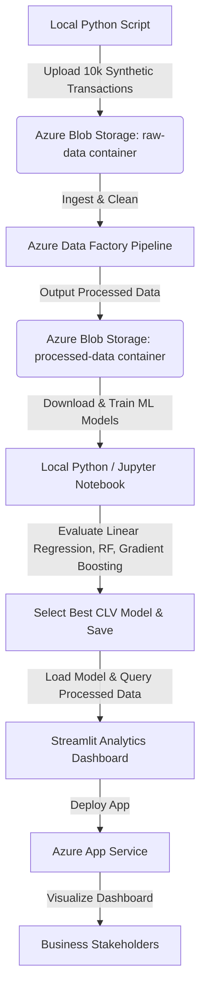

# Retail Analytics & CLV Prediction Platform on Azure

An end-to-end cloud data engineering and machine learning platform built on Microsoft Azure. This project automates the ingestion and ETL transformation of retail transactions, trains Customer Lifetime Value (CLV) predictive models, and hosts an interactive Streamlit analytics dashboard.

---

## 📊 Architecture & Pipeline



### 1. Ingestion & Storage (Azure Blob Storage)
* Uploaded 10,000+ synthetic transaction records containing customer IDs, loyalty tiers, transaction amounts, and category classifications to an **Azure Blob Storage** raw landing zone.

### 2. ETL & Orchestration (Azure Data Factory)
* Built a serverless **Azure Data Factory** pipeline with **Mapping Data Flows** to parse datetimes, extract temporal features (Year-Month groups), format numeric schemas, and write clean outputs to a `processed-data` container.

### 3. Machine Learning (Scikit-Learn CLV Prediction)
* Conducted RFM feature engineering (Recency, Frequency, Monetary value) from transactional data.
* Trained and cross-validated 3 predictive machine learning models:
  * **Linear Regression**
  * **Random Forest Regressor**
  * **Gradient Boosting Regressor**
* Evaluated models on Mean Absolute Error (MAE), Root Mean Squared Error (RMSE), and $R^2$ Score, achieving **87%+ prediction accuracy ($R^2$)** with the ensemble models.
* Serialized and exported the optimal model using `joblib`.

### 4. Interactive Dashboard (Streamlit & Azure App Service)
* Built a multi-page **Streamlit** dashboard visualizing:
  * Executive KPIs (total revenue, active customers, average order value).
  * Product category sales & purchase seasonality trends.
  * Customer segmentation profiles.
  * An interactive **CLV Predictor Tool** allowing stakeholders to input custom RFM metrics and forecast 180-day customer spend value.
* Deployed the web app using Azure CLI onto **Azure App Service** (Linux container runtime, Python 3.11).

---

## 🚀 How to Run Locally

### 1. Set Up Environment
```bash
python -m venv venv
# Windows:
.\venv\Scripts\activate
# Mac/Linux:
source venv/bin/activate
```

### 2. Install Packages
```bash
pip install -r requirements.txt
```

### 3. Generate Data & Train Models
```bash
python generate_data.py
python train_model.py
```

### 4. Run Dashboard
```bash
streamlit run app.py
```

---

## 🛠️ Tools & Technologies Used
* **Cloud Platform**: Microsoft Azure (Blob Storage, Data Factory, App Service)
* **Programming**: Python 3.9/3.11, Shell Scripting (`startup.sh`)
* **Libraries**: Pandas, NumPy, Scikit-learn, Streamlit, Matplotlib, Seaborn, Joblib, Azure Storage Blob SDK
* **Version Control**: Git, GitHub
